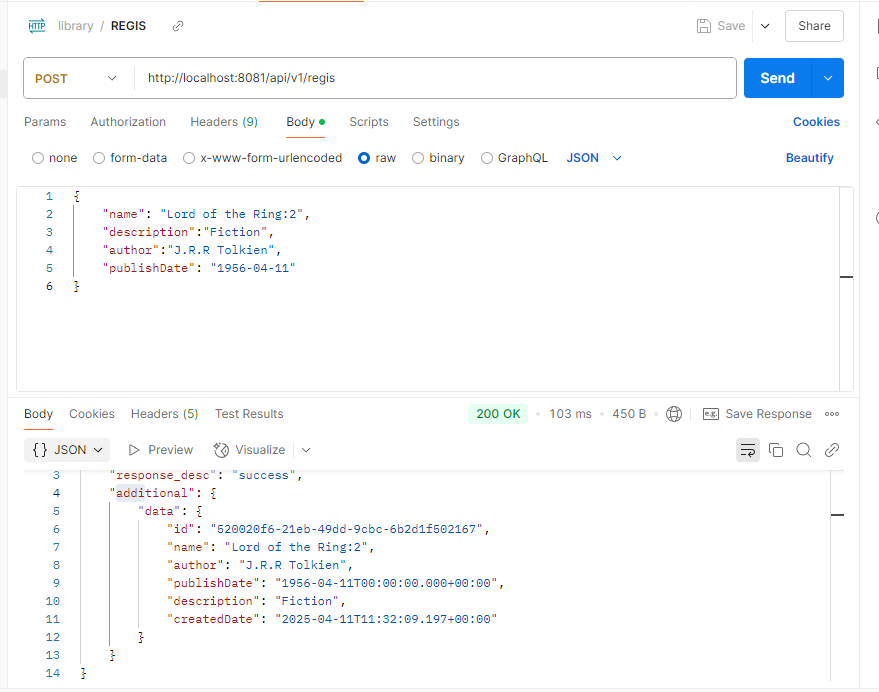
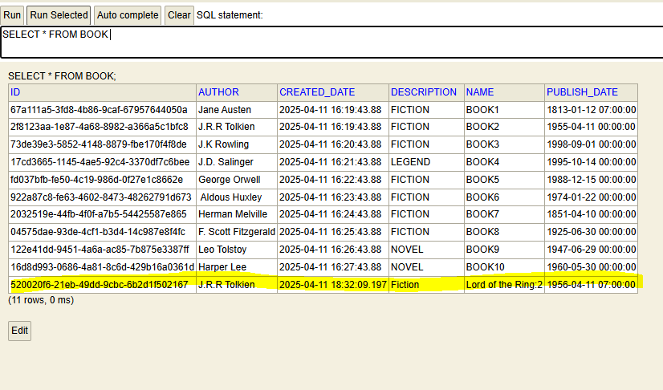
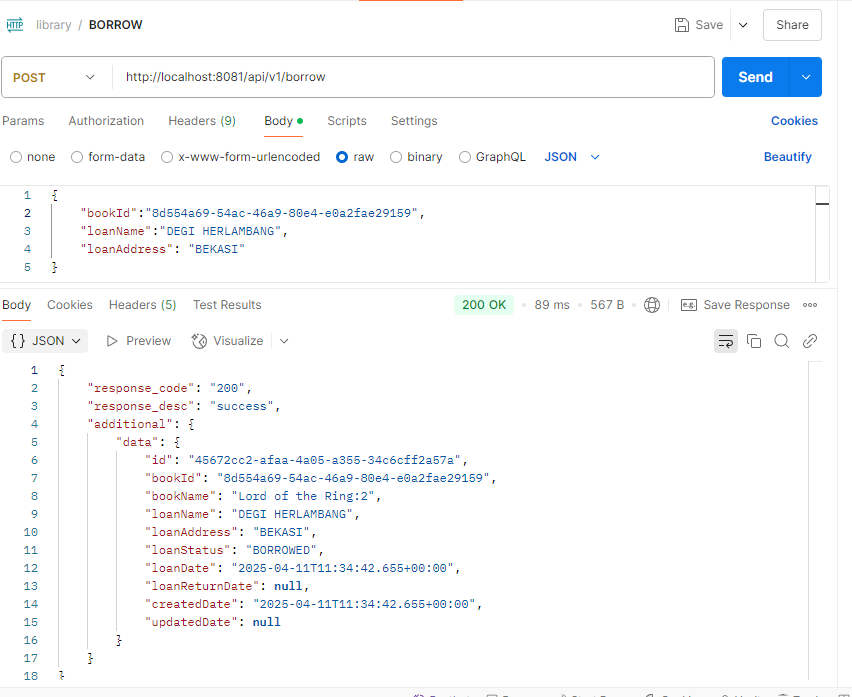
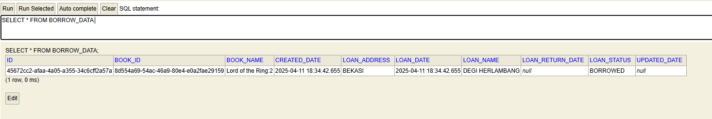
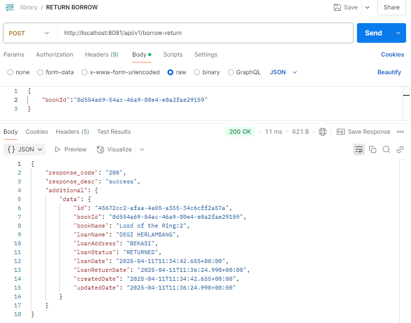
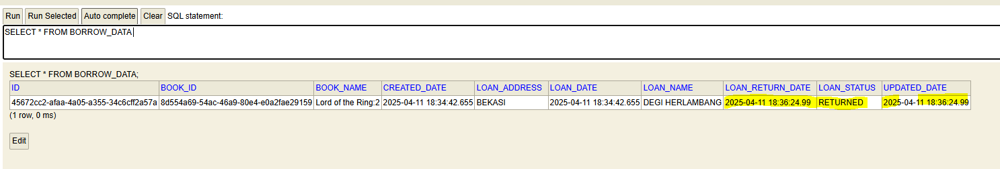
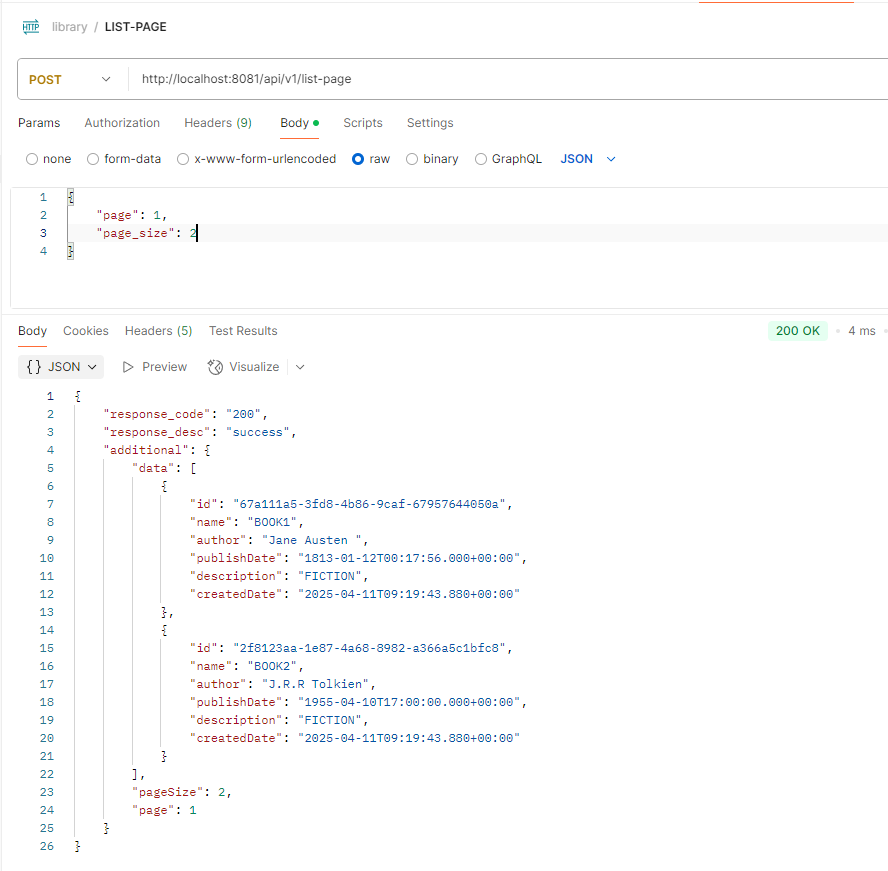
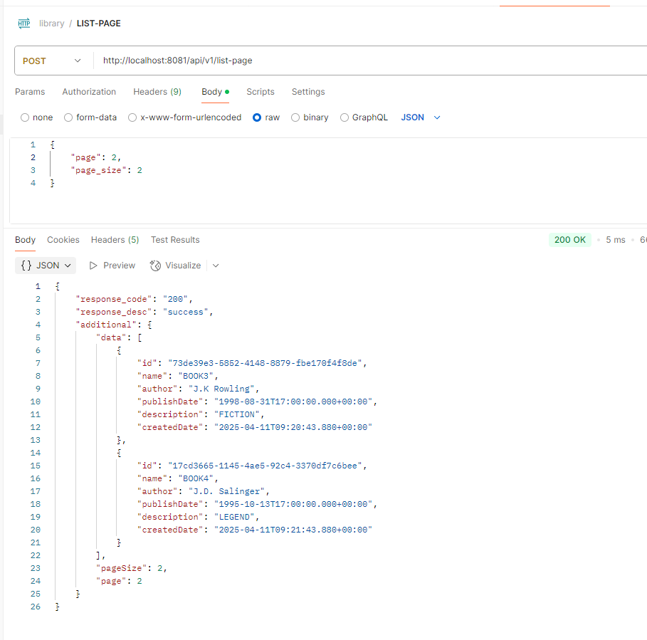
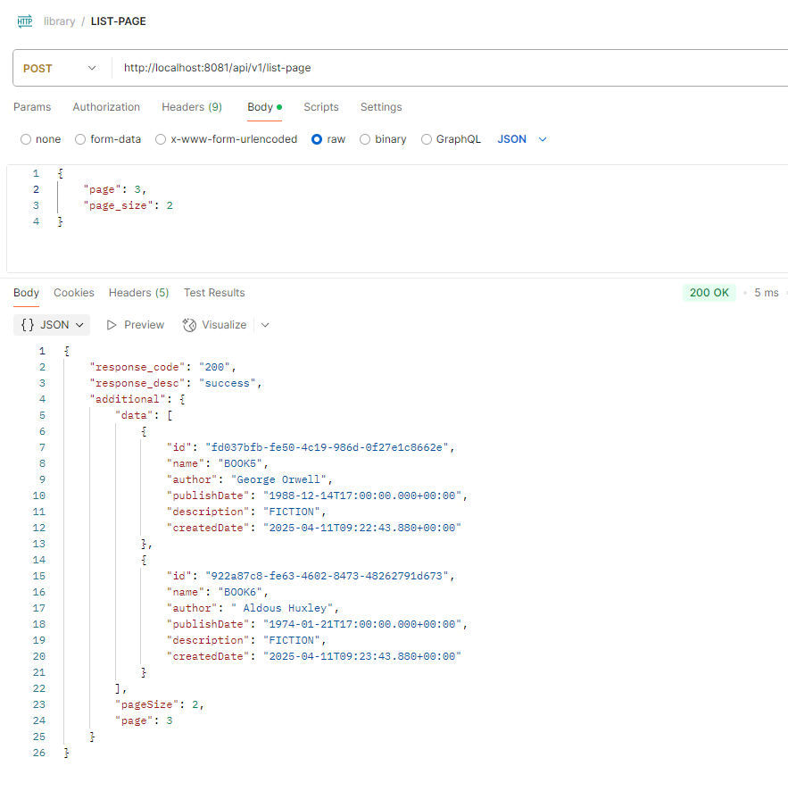

# LIBRARY

This project simple CRUD for Librarian. Using Springboot JAVA as framework projects and H2 Database.

This scope include:
1. Initial Books at Database
2. Regis new Book
3. Loan Book
4. Return Book
5. List Book with Pagination

First initial 10 books registered in table:
![img.png](img.png

Regis New Book Using REST API:

Save as new input:

Loan Book using REST API:

Save as new Input:

Return Loan Book using REST API:

Updated Loan Data:

List Book with Pagination using REST API:
Page: 1 PageSize: 2

Page: 2 PageSize:2

Page: 3 PageSize:2
